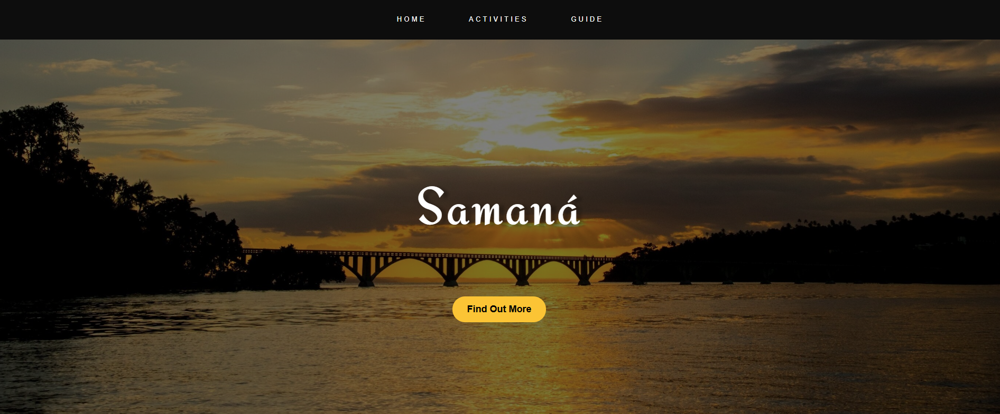
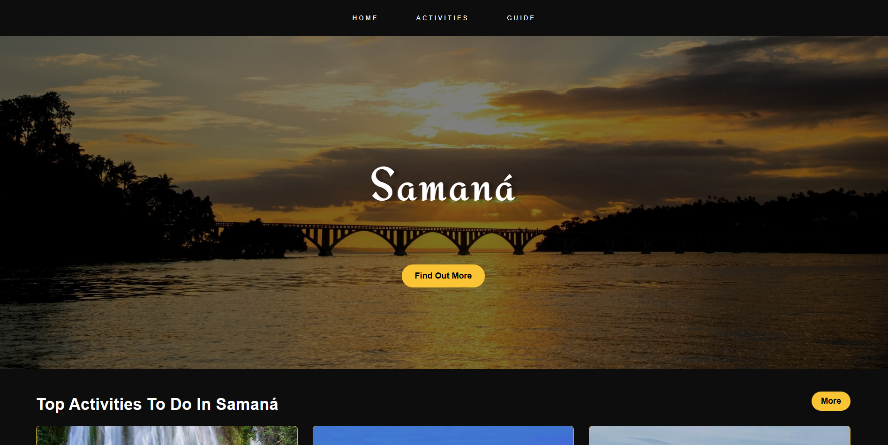
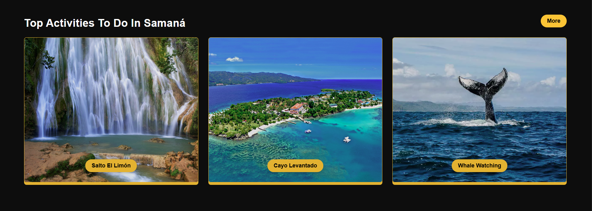
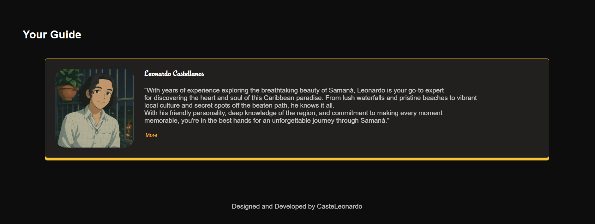

# 🌴 Discover Samaná

A vibrant and visually engaging landing page showcasing the beauty and top attractions of **Samaná**, Dominican Republic. Designed for travelers seeking an unforgettable tropical adventure.

## 🧭 About the Project

This project highlights the best things to do in Samaná through a modern web layout. From lush waterfalls to whale watching, it offers a taste of everything this paradise has to offer.

## 🛠️ Built With

- HTML5
- CSS3 (Flexbox and custom styles)
- Google Fonts

## 📱 Features

- Hero section with background image
- Highlight cards for key attractions:
  - Salto El Limón
  - Cayo Levantado
  - Whale Watching
- Profile section for a local guide
- Hover effects and modern layout

## 📷 Screenshots

## 👨‍💻 Author

**Leonardo Castellanos**  
Junior Software Developer | Font-End Developer | Web Designer  
📧 Email: [castellanosleonardo063@gmail.com / castellanosleonardo063@outlook.com]  
🔗 GitHub: [github.com/CasteLeonardo](https://github.com/CasteLeonardo)

---

Thanks for visiting! 🌅  

